# Waypoint

<p align="center">
  
</p>

<p align="center">
  <a href="https://github.com/liminal-hq/waypoint/actions/workflows/ci.yml"></a>
  
  
  
</p>

Waypoint is a tabbed, extensible file manager for Linux and Windows 11. It takes the calm, capable feel of Nemo and treats tabs, drag and drop, and remote locations as one connected system — so the file manager you keep open all day stays out of your way until you need it.

> **Status:** early development. The product design and the architecture are written, and the app skeleton runs (a windowed shell with the shared Liminal title bar and window menu). The file browser itself, tabs, drag and drop and the rest are still ahead, and there are no releases yet. The [milestones](docs/architecture/README.md#6-milestones) show what is coming and in what order.

## What Waypoint is for

- **Everywhere feels local.** SFTP, SMB, WebDAV, S3, Git repositories, archives and cloud drives browse, preview and drag like your home folder.
- **Drag and drop you can trust.** You always see the action before you release, and every drop can be undone. A persistent Shelf carries files between tabs and windows; folders, tabs and sidebar items spring open as you hover.
- **Tabs are workspaces.** Tear a tab off into its own window, merge it back by dropping it on another window's tab strip, pin it, colour it, group it, or join two tabs into a split view.
- **Extensible without being fragile.** Sandboxed extensions declare their permissions and add columns, actions, location providers, thumbnailers, previewers and panels. A crashed extension is switched off and the rest of the app carries on.
- **Native on every desktop.** Waypoint follows your colour scheme, accent and icon theme, looks at home on GNOME, KDE Plasma, Cinnamon and Windows 11, and can be translucent when you want it to be.
- **Keyboard parity.** Anything you can do with the mouse, you can do from the keyboard or the command palette, with Nemo, Dolphin and Explorer keymaps and an optional Vim mode.

## Platforms

| Platform                                             | Status                                                                    |
| ---------------------------------------------------- | ------------------------------------------------------------------------- |
| Linux (GNOME, KDE Plasma, Cinnamon; Wayland and X11) | Primary target. Portals first, so a Flatpak build works too.              |
| Windows 11                                           | A real target, written alongside the Linux code rather than ported later. |
| macOS                                                | Not planned.                                                              |

## Trying it from source

Waypoint is not ready for daily use, but you can run the current shell.

You will need [Bun](https://bun.sh), a Rust toolchain (the version is pinned in `rust-toolchain.toml`), and the [Tauri v2 prerequisites](https://v2.tauri.app/start/prerequisites/) for your system. On Linux, that includes WebKitGTK 4.1.

```bash
bun install
bun run tauri:dev
```

`tauri:dev` starts the desktop shell with the development settings the MCP automation tooling needs. To run the whole local check suite before contributing:

```bash
bun run validate
```

If Rust tooling is not installed locally, run the Rust and Tauri commands in the `ghcr.io/liminal-hq/tauri-dev-desktop:latest` container. To cross-build the Windows exe from Linux (`bun run build:windows`), use `ghcr.io/liminal-hq/tauri-dev-windows:latest`, which adds `cargo-xwin`, `clang-cl`, NSIS and the Windows Rust targets; the Microsoft SDK is fetched on the first build.

## How it is built

Waypoint is a Tauri v2 app with a React and TypeScript front end and a Rust back end, split by concern so the pieces can be reused.

- **Pure Rust crates** hold the domain logic (the virtual file system, the operations engine, session and tab state) with no dependency on Tauri, so they can be tested headlessly.
- **Tauri plugins** are the thin native layer: trash, thumbnails, volumes, secrets, terminals, window tear-off, native drag and drop, window effects and system appearance. The generic ones are written so they can be shared with other Liminal HQ apps.
- **The app** composes them. Rust owns the state, and the React front end renders it.

The reasoning, the crate and plugin split, the front-end framework evaluation and the milestones are in [`docs/architecture/`](docs/architecture/README.md).

## Documentation

The full index, with what each document covers and how the docs are kept current, is in [`docs/README.md`](docs/README.md). The essentials:

| File                                                             | What it covers                                                             |
| ---------------------------------------------------------------- | -------------------------------------------------------------------------- |
| [`SPEC.md`](SPEC.md)                                             | The product and design spec — start here for behaviour                     |
| [`docs/architecture/`](docs/architecture/README.md)              | Architecture, crates and plugins, front end, CI/CD, architecture decisions |
| [`docs/decisions.md`](docs/decisions.md)                         | The product and design decision log                                        |
| [`docs/goals-and-principles.md`](docs/goals-and-principles.md)   | Why Waypoint exists and what it will not do                                |
| [`docs/interactions.md`](docs/interactions.md)                   | Mouse, keyboard and drag-and-drop rules                                    |
| [`docs/plugins.md`](docs/plugins.md)                             | The extension model                                                        |
| [`docs/theming-and-platforms.md`](docs/theming-and-platforms.md) | Light and dark, OS theming, transparency, per-desktop frames               |
| [`docs/os-integrations.md`](docs/os-integrations.md)             | Linux and Windows integrations and fallbacks                               |
| [`docs/accessibility.md`](docs/accessibility.md)                 | Accessibility and focus review                                             |
| [`docs/translating.md`](docs/translating.md)                     | Adding a language and translating Waypoint                                 |
| [`docs/open-questions.md`](docs/open-questions.md)               | Unresolved items and assumptions                                           |

## Contributing

Waypoint follows the Liminal HQ house conventions: Canadian English, Conventional Commits, human-readable pull request titles, licence headers on source files, and no pushes to `main`. The full rules are in [`AGENTS.md`](AGENTS.md) (mirrored for Claude Code in [`CLAUDE.md`](CLAUDE.md)). Issues and pull requests are labelled by area (`tabs`, `drag-and-drop`, `remote`, `extensions`, `theming`, `accessibility`, and so on) so it is easy to find the part you care about.

## Part of Liminal HQ

Waypoint sits alongside [Jar](https://github.com/liminal-hq/jar), [Threshold](https://github.com/liminal-hq/threshold), [Cadence](https://github.com/liminal-hq/cadence) and [Spindle](https://github.com/liminal-hq/spindle), and shares their window chrome, tokens and conventions.

## Licence

Licensed under either of the [Apache License, Version 2.0](LICENSE-APACHE) or the [MIT licence](LICENSE-MIT), at your option.
